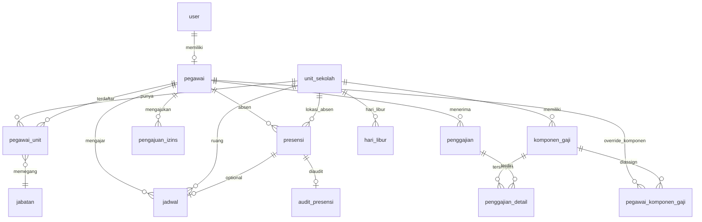
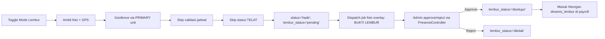
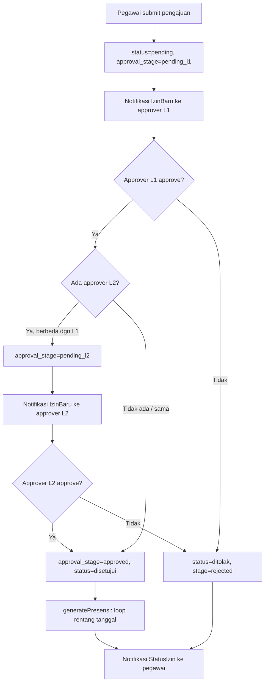
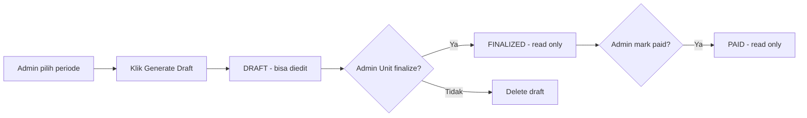

# DOKUMENTASI SISTEM HRIS YAYASAN

> Human Resource Information System — Yayasan Pendidikan Multi-Unit  
> Revisi: Juli 2026

---

## DAFTAR ISI

1. [Skema Data](#1-skema-data)
   - [Entity Relationship](#11-entity-relationship)
   - [Daftar Tabel & Kolom Penting](#12-daftar-tabel--kolom-penting)
   - [Daftar Enum/Status](#13-daftar-enumstatus)
2. [Alur Presensi](#2-alur-presensi)
   - [Flow Check-in/Check-out](#21-flow-check-incheck-out)
   - [Validasi Geofence](#22-validasi-geofence)
   - [Penentuan Status Hadir/Telat](#23-penentuan-status-hadirtelat)
   - [Coretan Anti-spoof](#24-coretan-anti-spoof)
   - [Pemrosesan Foto (Async Job)](#25-pemrosesan-foto-async-job)
   - [Cron Auto-alpa Harian](#26-cron-auto-alpa-harian)
   - [Alur Lembur](#27-alur-lembur)
3. [Alur Pengajuan Izin/Sakit/Cuti](#3-alur-pengajuan-izinsakitcuti)
   - [Submit & Approval Berjenjang (L1/L2)](#31-submit--approval-berjenjang-l1l2)
   - [Validasi Kuota Cuti & Lampiran](#32-validasi-kuota-cuti--lampiran)
   - [Tugas Pengganti & Pengaruh ke Bayaran](#33-tugas-pengganti--pengaruh-ke-bayaran)
   - [generatePresensi() — Detail](#34-generatepresensi--detail)
4. [Perhitungan Payroll](#4-perhitungan-payroll)
   - [Status & Siklus Payroll](#41-status--siklus-payroll)
   - [computeAttendance() — Detail Lengkap](#42-computeattendance--detail-lengkap)
   - [computeComponentNominal() — Detail Lengkap](#43-computecomponentnominal--detail-lengkap)
   - [Filter Unit & Status Kepegawaian — Contoh Konkret](#44-filter-unit--status-kepegawaian)
   - [Daftar Komponen Gaji (Juli 2026)](#45-daftar-komponen-gaji-juli-2026)
5. [Sistem Pendukung](#5-sistem-pendukung)
   - [Notifikasi](#51-notifikasi)
   - [Retensi Foto Presensi](#52-retensi-foto-presensi)
   - [Dashboard & Pelaporan](#53-dashboard--pelaporan)
   - [Audit Trail](#54-audit-trail)
6. [Keamanan yang Diterapkan](#6-keamanan-yang-diterapkan)
7. [Known Bugs yang Sudah Diperbaiki (Histori)](#7-known-bugs-yang-sudah-diperbaiki-histori)
8. [Yang Belum Selesai / Backlog](#8-yang-belum-selesai--backlog)

---

## 1. SKEMA DATA

### 1.1 Entity Relationship



### 1.2 Daftar Tabel & Kolom Penting

#### `unit_sekolah` — Unit sekolah (TK/SD/SMP/SMK/LPQ)

| Kolom | Tipe | Keterangan |
|-------|------|------------|
| `id` | bigint PK | |
| `nama` | string | Nama lengkap unit |
| `singkatan` | string | Kode singkat (TK, SD, dst) |
| `latitude`, `longitude` | decimal(10,8)/(11,8) | Pusat koordinat geofence |
| `radius_meter` | integer | Radius geofence, default 50m |
| `jam_masuk_kantor` | time | Default 07:30 |
| `jam_pulang_kantor` | time | Default 15:00 |
| `toleransi_menit` | integer | Toleransi keterlambatan, default 0 |

#### `pegawai` — Master data pegawai

| Kolom | Tipe | Keterangan |
|-------|------|------------|
| `id` | bigint PK | |
| `user_id` | bigint FK nullable | Link ke `users` |
| `nik` | text (encrypted) | NIK pegawai, encrypted cast |
| `nik_hash` | varchar(64) UNIQUE | SHA-256 hash NIK untuk pencarian |
| `nama_lengkap` | string | |
| `status_kepegawaian` | varchar | `tetap` / `kontrak` / `honorer` / `gtt` |
| `status_aktif` | enum | `aktif` / `cuti` / `nonaktif` / `resign` |
| `tanggal_mulai_kerja` | date | Dipakai hitung masa bakti |
| `atasan_langsung_id` | bigint FK | Self-reference ke pegawai lain |
| `jatah_cuti_tahunan` | integer | Default 12 |
| `wajib_kantor` | boolean | Jika true & tidak punya jadwal hari ini, absen ke primary unit |
| `no_rekening`, `nama_bank`, `npwp`, `no_bpjs_*` | text (encrypted) | Field sensitif dienkripsi |

**Accessor**: `sisa_cuti` = `jatah_cuti_tahunan - cuti_terpakai` (via PengajuanIzin approved), `nik_masked`

#### `pegawai_unit` — Pivot pegawai ↔ unit

| Kolom | Tipe | Keterangan |
|-------|------|------------|
| `pegawai_id` | bigint FK | |
| `unit_sekolah_id` | bigint FK | |
| `jabatan_id` | bigint FK | |
| `is_primary` | boolean | Unit utama untuk geofence lembur |

#### `jadwal` — Jadwal mengajar/harian

| Kolom | Tipe | Keterangan |
|-------|------|------------|
| `id` | bigint PK | |
| `pegawai_id` | bigint FK | |
| `unit_sekolah_id` | bigint FK | |
| `hari` | enum | `Senin`..`Minggu` |
| `jam_mulai` | time | |
| `jam_selesai` | time | |
| `jenis_jadwal` | enum | `mengajar` / `piket` / `ekskul` / `shift_satpam` / `shift_kebersihan` / `lainnya` |
| `tahun_ajaran` | varchar(10) | |
| `semester` | tinyint | |

#### `presensi` — Catatan kehadiran harian per jadwal

| Kolom | Tipe | Keterangan |
|-------|------|------------|
| `id` | bigint PK | |
| `pegawai_id` | bigint FK | |
| `jadwal_id` | bigint FK nullable | `null` untuk lembur/kantor |
| `unit_sekolah_id` | bigint FK | |
| `tipe_presensi` | varchar(20) | `mengajar` / `kantor` / `lembur` |
| `tanggal` | date | |
| `jam_masuk` | time nullable | Waktu check-in |
| `jam_keluar` | time nullable | Waktu check-out |
| `latitude_masuk` / `longitude_masuk` | decimal | Koordinat saat check-in |
| `foto_masuk` / `foto_keluar` | string | Path foto relatif |
| `foto_masuk_status` / `foto_keluar_status` | varchar(20) | `pending` / `processing` / `success` / `failed` / `expired` |
| `jarak_masuk_meter` / `jarak_keluar_meter` | integer | |
| `akurasi_masuk` / `akurasi_keluar` | decimal(8,2) | GPS accuracy dalam meter |
| `kecepatan_masuk` / `kecepatan_keluar` | decimal(8,2) | m/s |
| `status` | enum | `hadir` / `telat` / `izin` / `sakit` / `alpa` |
| `is_lembur` | boolean | |
| `lembur_status` | varchar(20) nullable | `pending` / `disetujui` / `ditolak` |
| `persentase_bayar_jam` | tinyint nullable | % jam dibayar (untuk izin dgn tugas pengganti) |
| `lokasi_perlu_review` | boolean | Flag review manual |
| `posisi_mencurigakan` | boolean | Flag posisi aneh (uji silang pos_A vs pos_B) |
| `captured_at` | timestamp | Waktu sebenarnya foto diambil (client-side) |
| `pos_a_lat`, `pos_a_lng`, `pos_a_accuracy`, `pos_a_captured_at` | | Titik posisi pertama (untuk uji silang jarak AB) |

**UNIQUE**: `(pegawai_id, tanggal, jadwal_id)`  
**Indexes**: `(pegawai_id, tanggal, status)`, `(pegawai_id, tanggal, tipe_presensi)`, `(tanggal)`, `(unit_sekolah_id, tanggal)`, `(status)`, `(is_lembur)`, `(lembur_status)`

#### `pengajuan_izins` — Pengajuan izin/sakit/cuti

| Kolom | Tipe | Keterangan |
|-------|------|------------|
| `id` | bigint PK | |
| `pegawai_id` | bigint FK | |
| `jenis_izin` | enum | `sakit` / `izin` / `cuti` |
| `tanggal_mulai` / `tanggal_selesai` | date | Rentang izin |
| `alasan` | text | |
| `bukti_foto` | string nullable | Lampiran (wajib untuk sakit) |
| `status` | enum | `pending` / `disetujui` / `ditolak` |
| `approval_stage` | varchar | `pending_l1` / `pending_l2` / `approved` / `rejected` |
| `approver_l1_id` | bigint FK nullable | |
| `approver_l2_id` | bigint FK nullable | |
| `approved_at_l1` / `approved_at_l2` | timestamp nullable | |
| `rejected_by` | bigint FK nullable | |
| `alasan_penolakan` | text nullable | |

#### `penggajian` — Slip gaji per pegawai per periode

| Kolom | Tipe | Keterangan |
|-------|------|------------|
| `id` | bigint PK | |
| `pegawai_id` | bigint FK | |
| `periode_bulan` | varchar(7) | Format `m-Y` (mis. `06-2026`) |
| `tanggal_generate` | date | |
| `total_pendapatan` | decimal(15,2) | Jumlah semua komponen pendapatan |
| `total_potongan` | decimal(15,2) | Jumlah semua komponen potongan |
| `gaji_bersih` | decimal(15,2) | `total_pendapatan - total_potongan` |
| `total_taxable` | decimal(15,2) | Jumlah pendapatan kena pajak |
| `status` | enum | `draft` / `finalized` / `paid` |

**UNIQUE**: `(pegawai_id, periode_bulan)`

#### `penggajian_detail` — Baris detail per komponen gaji

| Kolom | Tipe | Keterangan |
|-------|------|------------|
| `id` | bigint PK | |
| `penggajian_id` | bigint FK | |
| `komponen_gaji_id` | bigint FK nullable | |
| `nama_komponen` | string | Snapshot nama komponen |
| `tipe` | enum | `pendapatan` / `potongan` |
| `nominal` | decimal(15,2) | |
| `is_taxable` | boolean | |

#### `komponen_gaji` — Definisi komponen gaji

| Kolom | Tipe | Keterangan |
|-------|------|------------|
| `id` | bigint PK | |
| `nama` | string | |
| `kode` | varchar(50) nullable | `gaji_pokok`, `tunjangan_kehadiran`, dll |
| `tipe` | enum | `pendapatan` / `potongan` |
| `jenis` | varchar(50) | `fixed` / `persentase` / `dinamis_kehadiran` / `dinamis_masa_bakti` / `dinamis_jam_mengajar` / `dinamis_lembur` |
| `applies_to_status_kepegawaian` | varchar(50) nullable | `tetap` / `honorer` / null (ALL) |
| `nilai_default` | decimal(15,2) | Nilai default (untuk persentase: persen, dibagi 100 di kode) |
| `unit_sekolah_id` | bigint FK nullable | Scope per unit |
| `is_taxable` | boolean | |
| `is_active` | boolean | |
| `urutan` | integer | Default 99 |
| `tampil_di_matrix` | boolean | |
| `syarat_bayar_jam_mengajar` | varchar(30) nullable | `hanya_hadir` / `semua_jadwal`. Digunakan saat `jenis=dinamis_jam_mengajar`. Null = default `hanya_hadir`. |

#### `skala_masa_baktis` — Tabel bracket masa bakti

| Kolom | Tipe | Keterangan |
|-------|------|------------|
| `id` | bigint PK | |
| `masa_kerja_tahun` | integer UNIQUE | Tahun ke- (0, 1, 2...) |
| `nominal_gaji` | decimal(15,2) | Tunjangan untuk bracket ini |

#### `hari_libur` — Kalender libur per unit

| Kolom | Tipe | Keterangan |
|-------|------|------------|
| `id` | bigint PK | |
| `tanggal` | date | |
| `nama` | varchar(100) | Nama hari libur |
| `unit_sekolah_id` | bigint FK nullable | `null` = nasional (semua unit) |
| `tipe` | varchar(20) | Default `nasional` |

**UNIQUE**: `(tanggal, unit_sekolah_id)`

#### `audit_presensi` — Log perubahan data presensi

| Kolom | Tipe | Keterangan |
|-------|------|------------|
| `id` | bigint PK | |
| `presensi_id` | bigint FK | |
| `user_id` | bigint FK nullable | Pelaku |
| `aksi` | varchar(50) | `generate_izin`, `ubah_status`, `approve_lembur`, `reject_lembur` |
| `field` | varchar(50) nullable | Kolom yang berubah |
| `nilai_lama` / `nilai_baru` | varchar(100) nullable | |
| `keterangan` | text nullable | |

### 1.3 Daftar Enum/Status

#### `presensi.status`
| Nilai | Arti | Siapa yang set |
|-------|------|----------------|
| `hadir` | Absen masuk on time | System (saat check-in) |
| `telat` | Absen masuk melewati jam + toleransi | System (saat check-in) |
| `izin` | Hari izin (disetujui) | `generatePresensi()` dari PengajuanIzin |
| `sakit` | Hari sakit (disetujui) | `generatePresensi()` dari PengajuanIzin |
| `alpa` | Tidak ada presensi hari itu (default) | Cron `presensi:finalize-alpa` |

#### `pengajuan_izins.approval_stage`
| Nilai | Arti |
|-------|------|
| `pending_l1` | Menunggu approval atasan L1 |
| `pending_l2` | L1 approved, menunggu L2 |
| `approved` | Final approved (generatePresensi() dijalankan) |
| `rejected` | Ditolak (oleh L1 atau L2) |

#### `pengajuan_izins.jenis_izin`
| Nilai | Arti | Kurangi sisa cuti? |
|-------|------|--------------------|
| `sakit` | Izin sakit | Tidak |
| `izin` | Izin umum | Tidak |
| `cuti` | Cuti tahunan | Ya |

#### `penggajian.status`
| Nilai | Arti | Bisa diedit? | Presensi terkunci? |
|-------|------|--------------|---------------------|
| `draft` | Baru digenerate, masih bisa edit | Ya | Tidak |
| `finalized` | Dikunci admin unit | Tidak | Ya (status & lembur terproteksi) |
| `paid` | Dibayar ke pegawai | Tidak | Ya |

#### `pegawai.status_kepegawaian`
| Nilai | Arti |
|-------|------|
| `tetap` | Pegawai tetap/GTYS |
| `honorer` | Pegawai honorer |
| `kontrak` | Pegawai kontrak |
| `gtt` | Guru Tidak Tetap |

#### `pegawai.status_aktif`
| Nilai | Arti |
|-------|------|
| `aktif` | Aktif bekerja |
| `cuti` | Sedang cuti panjang |
| `nonaktif` | Nonaktif sementara |
| `resign` | Berhenti |

#### `presensi.foto_*_status` (untuk foto_masuk_status & foto_keluar_status)
| Nilai | Arti |
|-------|------|
| `pending` | Foto baru diupload, menunggu diproses |
| `processing` | Sedang diproses oleh job queue |
| `success` | Berhasil diproses (resize + overlay) |
| `failed` | Gagal diproses, error di `foto_*_error` |
| `expired` | Foto dihapus oleh cron cleanup |

#### `presensi.is_lembur` + `lembur_status`
| is_lembur | lembur_status | Arti |
|-----------|---------------|------|
| `false` | `null` | Presensi reguler |
| `true` | `pending` | Lembur baru diajukan, belum di-approve |
| `true` | `disetujui` | Lembur sudah di-approve admin (masuk hitungan payroll) |
| `true` | `ditolak` | Lembur ditolak |

#### `presensi.jenis_jadwal` (di tabel `jadwal`)
`mengajar` / `piket` / `ekskul` / `shift_satpam` / `shift_kebersihan` / `lainnya`

---

## 2. ALUR PRESENSI

### 2.1 Flow Check-in/Check-out

```mermaid
flowchart TD
    A[Mulai] --> B{Pilih jadwal?}
    B -->|Ya| C[Jadwal dipilih]
    B -->|Tidak| D{Mode Lembur?}
    D -->|Ya| E[Skip jadwal, is_lembur=true]
    D -->|Tidak| F{wajib_kantor?}
    F -->|Ya| G[Primary unit, tanpa jadwal]
    F -->|Tidak| H[Error: pilih jadwal dulu]
    
    C --> I[Ambil foto + GPS]
    E --> I
    G --> I
    
    I --> J[Validasi foto: format base64]
    J -->|Invalid| K[Error: foto tidak valid]
    J -->|Valid| L[Haversine: distance vs radius_meter]
    
    L -->|> radius| M[Error: di luar radius]
    L -->|<= radius| N[Validasi accuracy GPS]
    
    N -->|<= 0| O[Error: mock GPS suspect]
    N -->|> 0| P{tipe = 'masuk'?}
    
    P -->|Ya| Q[DB transaction + lockForUpdate]
    Q --> R[Check existing presensi]
    R -->|sudah ada jam_masuk| S[Error: sudah absen masuk]
    R -->|belum| T[Set jam_masuk, koordinat, foto_status=pending]
    T --> U{Tentukan status}
    U -->|Lembur| V[status=hadir, lembur_status=pending]
    U -->|Reguler| W[statusAt(jam_now, jam_jadwal, toleransi)]
    W -->|now > batas| X[status=telat]
    W -->|now <= batas| Y[status=hadir]
    V --> Z[Save + commit]
    X --> Z
    Y --> Z
    
    P -->|Keluar| AA[Check jam_masuk exists]
    AA -->|Tidak| AB[Error: belum absen masuk]
    AA -->|Ya| AC[Check jam_keluar]
    AC -->|Sudah| AD[Error: sudah absen keluar]
    AC -->|Belum| AE[Set jam_keluar, koordinat, foto_status=pending]
    AE --> AF[Lokasi perlu review? pulang awal?]
    AF --> Z
    
    Z --> AG[Dispatch ProcessPresensiFoto job]
    AG --> AH[Selesai - return success response]
```

**Kode**: `MobileController@storeAbsen` (`app/Http/Controllers/MobileController.php:257-508`)

### 2.2 Validasi Geofence

Formula **Haversine** (trait `CalculatesDistance`):

```php
private function calculateDistance($lat1, $lon1, $lat2, $lon2): int
{
    $earthRadius = 6371000; // meter
    $dLat = deg2rad($lat2 - $lat1);
    $dLon = deg2rad($lon2 - $lon1);
    $a = sin($dLat / 2) * sin($dLat / 2)
       + cos(deg2rad($lat1)) * cos(deg2rad($lat2))
       * sin($dLon / 2) * sin($dLon / 2);
    $c = 2 * asin(sqrt($a));
    return (int) round($earthRadius * $c);
}
```

**Alur validasi berantai**:

1. Hitung `distance = Haversine(lat_user, lon_user, lat_unit, lon_unit)`
2. Jika `distance > unit->radius_meter` → tolak (error: di luar radius)
3. Jika `accuracy <= 0` → tolak (error: mock GPS)
4. Jika `accuracy > radius_meter` → tolak (akurasi terlalu rendah)
5. Uji silang posisi: jika `pos_a` dan `pos_b` ada, hitung jarak AB dan selisih waktu. Jika jarak < 3m tapi selisih waktu > 10 detik → `posisi_mencurigakan = true`
6. `lokasi_perlu_review = mock_suspect || accuracy < 10`

### 2.3 Penentuan Status Hadir/Telat

```php
// Presensi.php
public static function statusAt(string $actualTime, string $requiredTime, int $toleransiMenit = 0): string
{
    $batasWaktu = Carbon::parse($requiredTime)->addMinutes($toleransiMenit)->format('H:i:s');
    return $actualTime > $batasWaktu ? 'telat' : 'hadir';
}
```

- `$actualTime` = `Carbon::now()->format('H:i:s')` (waktu server)
- `$toleransiMenit` = `unit_sekolah.toleransi_menit` (default 0)
- Perbandingan string `H:i:s` — no tolerance in minutes
- Status ditentukan **SAAT absen MASUK** saja. Absen keluar tidak mengubah status.

**Untuk tipe kantor** (tanpa jadwal): `$requiredTime = unit->jam_masuk_kantor` (default 07:30)  
**Untuk tipe mengajar** (dengan jadwal): `$requiredTime = jadwal->jam_mulai`

### 2.4 Coretan Anti-spoof

Setiap kali absen, client wajib mengirim:

| Field | Required | Validasi |
|-------|----------|----------|
| `latitude` / `longitude` | Ya | Numeric, range valid |
| `accuracy` | Ya | `>= 0` |
| `speed` | Tidak | `>= 0` |
| `captured_at` | Tidak | Tanggal valid |
| `mock_suspect` | Tidak | Boolean |
| `pos_a_lat` / `pos_a_lng` | Tidak | Uji silang posisi |
| `pos_a_accuracy` | Tidak | |
| `pos_a_captured_at` | Tidak | |

**Deteksi posisi mencurigakan**: Jika jarak antara `pos_a` dan titik absen < 3 meter tapi selisih waktu > 10 detik, atau accuracy kedua titik identik → `posisi_mencurigakan = true`.

### 2.5 Pemrosesan Foto (Async Job)

Setiap kali absen, `ProcessPresensiFoto` job di-dispatch:

```php
ProcessPresensiFoto::dispatch(
    $presensi->id,
    $tipe,           // 'masuk' | 'keluar'
    $tempPath,       // 'temp/{uuid}.jpg'
    $subdirectory,   // 'presensi/lembur' | 'presensi'
    $overlayData,    // Data untuk burn-in overlay di foto
    $pegawaiInfo,    // ['id' => ..., 'nama' => ...]
);
```

**Lifecycle foto status**:

```
pending ──[job ambil]──> processing ──[success]──> success
                                       ──[failed]──> failed + error message
Silent fallback: jika job gagal, foto tetap disimpan di temp, status tetap 'pending'
```

**Overlay foto** (burn-in canvas):
- Label: `BUKTI LEMBUR` (jika lembur) / `BUKTI PRESENSI`
- Nama pegawai, unit, waktu `HH:mm:ss WIB`, tanggal, koordinat, akurasi

### 2.6 Cron Auto-alpa Harian

```
Schedule: presensi:finalize-alpa → dailyAt('01:00') tanpa overlapping
```

**Logic** (`FinalizeAlpa.php`):

1. Tentukan tanggal target (default: kemarin, override via `--date=YYYY-MM-DD`)
2. Cek hari libur nasional (`hari_libur` dengan `unit_sekolah_id IS NULL`)
3. Loop semua pegawai aktif:
   - Skip jika hari libur nasional
   - Ambil jadwal pegawai untuk hari target
   - Skip jika tidak punya jadwal
   - Skip jika semua unit jadwal sedang libur (hari libur per unit)
   - Skip jika sudah ada presensi hari itu
   - Buat record presensi baru: `status='alpa'`, `keterangan='Auto-mark alpa'`

**PENTING**: Ini per-jadwal, bukan per-hari. Pegawai dengan jadwal di hari target mendapat record alpa. Pegawai tanpa jadwal di-skip.

### 2.7 Alur Lembur



- `jadwal_id` = null untuk lembur
- Geofence menggunakan unit PRIMARY pegawai (jika tidak punya, error)
- Tidak ada toleransi/status telat untuk lembur
- Foto overlay: label "BUKTI LEMBUR" + nama + unit + waktu + lokasi
- Approval: `PresensiController@approveLembur` / `rejectLembur`
- **PENTING**: `lembur_status` ada di `$guarded` model — saat ini `approveLembur()`/`rejectLembur()` menggunakan `$presensi->update(['lembur_status' => ...])` yang **silent drop** (`$guarded` mencegah mass-assignment). Perlu refactor ke direct assignment + `save()`. (lihat §7 Known Bugs)

---

## 3. ALUR PENGAJUAN IZIN/SAKIT/CUTI

### 3.1 Submit & Approval Berjenjang (L1/L2)



**Aturan siapa approve**:

- `approver_l1_id` bisa dari `pegawai.atasan_langsung_id`, atau manual setting di form pengajuan
- `approver_l2_id` bisa atasan kedua atau null (tidak wajib)
- Superadmin bisa approve di level manapun
- **Fallback**: jika `approver_l1_id === approver_l2_id`, hanya perlu 1 step approval

```php
// PengajuanIzinController@approve
if ($pengajuan->approver_l2_id && $pengajuan->approver_l2_id !== $pengajuan->approver_l1_id) {
    $pengajuan->approval_stage = 'pending_l2';
    // Notifikasi ke L2
} else {
    $pengajuan->approval_stage = 'approved';
    $pengajuan->status = 'disetujui';
    $this->generatePresensi($pengajuan);
}
```

### 3.2 Validasi Kuota Cuti & Lampiran

**Cuti tahunan**:
- `sisa_cuti = jatah_cuti_tahunan (default 12) - cuti_terpakai`
- `cuti_terpakai` = jumlah hari dari pengajuan cuti yang sudah disetujui
- Validasi: `requested_days <= sisa_cuti`, jika tidak → tolak

**Sakit**: wajib upload `bukti_foto` (lampiran)

**Izin/sakit**: tidak mengurangi sisa cuti

### 3.3 Tugas Pengganti & Pengaruh ke Bayaran

Tidak di-implementasi via form. Persentase bayar diatur via kolom `presensi.persentase_bayar_jam`:

| Skenario | `persentase_bayar_jam` | Efek ke payroll |
|----------|------------------------|-----------------|
| Tidak ada tugas pengganti | `null` or `0` | Jam mengajar TIDAK dibayar |
| Ada tugas pengganti (izin dgn_tugas) | `50` (dari `PayrollConstants::PERSENTASE_IZIN_DENGAN_TUGAS`) | Jam mengajar dibayar 50% |

**Flow**: Admin manual set `persentase_bayar_jam` di form edit presensi (saat ini belum ada UI-nya, perlu dibangun).

Perhitungan `dinamis_jam_mengajar` sekarang dikontrol oleh kolom `komponen_gaji.syarat_bayar_jam_mengajar` — lihat §4.3#5 untuk detailnya. Default `'hanya_hadir'` (hanya jadwal dgn presensi `hadir`/`telat` yg dibayar).

### 3.4 generatePresensi() — Detail

```php
// PengajuanIzinController@generatePresensi
private function generatePresensi(PengajuanIzin $pengajuan): void
{
    $pegawai = $pengajuan->pegawai;
    $primaryUnit = $pegawai->units()->wherePivot('is_primary', true)->first()
        ?? $pegawai->units()->first();
    $unitId = $primaryUnit?->id;

    $period = CarbonPeriod::create($pengajuan->tanggal_mulai, $pengajuan->tanggal_selesai);
    foreach ($period as $date) {
        if ($date->isWeekend()) continue;
        if (PayrollLockHelper::isPeriodLocked($pengajuan->pegawai_id, $date)) continue;

        $presensi = Presensi::updateOrCreate(
            ['pegawai_id' => $pengajuan->pegawai_id, 'tanggal' => $date->format('Y-m-d')],
            ['unit_sekolah_id' => $unitId, 'keterangan' => 'Dari Pengajuan Izin/Cuti']
        );

        $presensi->status = $pengajuan->jenis_izin; // 'sakit' | 'izin' | 'cuti'
        $presensi->save();

        AuditPresensi::log($presensi->id, 'generate_izin', ...);
    }
}
```

Detail:
- Loop `tanggal_mulai` sampai `tanggal_selesai`
- Skip weekend (Sabtu, Minggu)
- Skip tanggal yang sudah terkunci payroll (`finalized`/`paid`)
- `updateOrCreate` tanpa `status` di array kedua — lalu set langsung: `$presensi->status = $pengajuan->jenis_izin; $presensi->save();`
- Ini penting: `status` ada di `$guarded`, jadi `updateOrCreate` dengan `'status' => ...` akan silent drop. **Bug ini sudah diperbaiki** (lihat §7)

---

## 4. PERHITUNGAN PAYROLL

### 4.1 Status & Siklus Payroll



| Status | Siapa yang bisa ubah? | Presensi terkunci? |
|--------|----------------------|--------------------|
| `draft` | Admin HR (edit worksheet), superadmin (delete) | Tidak |
| `finalized` | Tidak ada (read-only) | **Ya** — `PayrollLockHelper::isPeriodLocked()` return true |
| `paid` | Tidak ada (read-only) | **Ya** |

**`authorizePayrollModification()`**: Hanya admin unit (bukan superadmin) yang bisa finalize/destroy/markPaid.

### 4.2 computeAttendance() — Detail Lengkap

```php
// PenggajianController@computeAttendance
protected function computeAttendance(Pegawai $pegawai, $attendanceByPegawai, 
    Carbon $periodeStart, Carbon $attendanceCutoff): array
```

**Variabel**:

| Variabel | Sumber | Arti |
|----------|--------|------|
| `$countHadir` | `Presensi::where('status','hadir')` | Jumlah hari hadir |
| `$countTelat` | `Presensi::where('status','telat')` | Jumlah hari telat |
| `$countAlpaManual` | `Presensi::where('status','alpa')` | Alpa yang sudah tercatat (dari cron/tangan) |
| `$countSakit` | `Presensi::where('status','sakit')` | Dari generatePresensi() |
| `$countIzin` | `Presensi::where('status','izin')` | Dari generatePresensi() |
| `$countCuti` | `Presensi::where('status','cuti')` | Dari generatePresensi() |
| `$workingDays` | Dihitung dari jadwal | Jumlah hari kerja dalam periode |
| `$presentOrLeave` | `hadir+telat+sakit+izin+cuti` | Hari dengan status (presence or leave) |
| `$countAlpa` | `alpaManual + max(0, workingDays - presentOrLeave)` | **Final**: manual + auto-fill gap |

**Rumus working days** (O(1) `countWeekdayInRange`):

```
workingDays = SUM from each non-lembur jadwal
    of countWeekdayInRange(jadwal.hari, periodeStart, attendanceCutoff)

countWeekdayInRange(hari, start, end):
    totalDays = end - start + 1
    fullWeeks = totalDays / 7
    remainder = totalDays % 7
    count = fullWeeks
    for i in 0..remainder-1:
        if (startDayOfWeek + i) % 7 == target:
            count++
    return count
```

**Rumus alpa final**:

```
countAlpa = alpaManual + max(0, workingDays - (hadir + telat + sakit + izin + cuti))
```

### 4.3 computeComponentNominal() — Detail Lengkap

```php
protected function computeComponentNominal(
    KomponenGaji $komponen, Pegawai $pegawai, $pegawaiKomponens, 
    $globalKomponens, array $counts, $skalas, 
    Carbon $periodeEnd, Carbon $periodeStart, Carbon $attendanceCutoff, $lemburByPegawai
): float
```

#### Filter awal
```php
// Skip komponen yang tidak sesuai status kepegawaian
if ($komponen->applies_to_status_kepegawaian
    && $komponen->applies_to_status_kepegawaian !== $pegawai->status_kepegawaian) {
    return 0;
}

// Skip komponen yang discope ke unit lain
if ($komponen->unit_sekolah_id && !in_array($komponen->unit_sekolah_id, $pegawaiUnitIds)) {
    continue; // (ini di loop createDraft, bukan di computeComponentNominal)
}
```

#### 1. `fixed` — Nilai tetap

```
nominal = pivot.nominal ?? nilai_default ?? 0
```

- Jika ada override di pivot `pegawai_komponen_gaji.nominal`, pakai itu
- Jika tidak, pakai `komponen.nilai_default`

#### 2. `persentase` — Persentase dari gaji pokok

```
baseSalary = Gaji Pokok.nominal (pivot first, lalu nilai_default)
nominal = (komponen.nilai_default / 100) * baseSalary
```

- Mencari komponen Gaji Pokok via `findKomponenByKode($globalKomponens, 'gaji_pokok', ['Gaji Pokok', 'Basic Salary'])`
- Base salary HANYA dari komponen `gaji_pokok`, bukan dari total pendapatan

#### 3. `dinamis_kehadiran` — Rate × count kehadiran

```
rate = pivot.nominal ?? nilai_default ?? 0

IF kode='kehadiran_telat' OR nama mengandung 'telat':
    nominal = rate × counts['telat']
ELIF kode='kehadiran_alpa' OR nama mengandung 'alpa':
    nominal = rate × counts['alpa']
ELIF kode='kehadiran_sakit' OR nama mengandung 'sakit':
    nominal = rate × counts['sakit']
ELIF kode='kehadiran_izin' OR nama mengandung 'izin':
    nominal = rate × counts['izin']
ELIF kode='kehadiran_cuti' OR nama mengandung 'cuti':
    nominal = rate × counts['cuti']
ELIF kode='tunjangan_kehadiran' OR nama mengandung 'makan'/'transport'/'hadir':
    nominal = rate × (counts['hadir'] + counts['telat'])
ELSE:
    nominal = 0
```

Priority lookup: `kode` column exact match → `stripos(nama, pattern)` fallback (backward compat)

#### 4. `dinamis_masa_bakti` — Bracket masa kerja

```
IF pivot.nominal exists:
    nominal = pivot.nominal
ELSE:
    yearsOfService = tanggal_mulai_kerja->diffInYears(periodeEnd)
    skala = skalas.first where masa_kerja_tahun <= yearsOfService (DESC order)
    nominal = skala.nominal_gaji ?? 0
```

#### 5. `dinamis_jam_mengajar` — Rate × jam mengajar

```
rate = pivot.nominal ?? nilai_default ?? 0
syarat = komponen.syarat_bayar_jam_mengajar ?? 'hanya_hadir'

if syarat == 'hanya_hadir':
    attendedJadwalIds = query:
        SELECT jadwal_id, count(*) as total FROM presensi
        WHERE pegawai_id = ?
          AND jadwal_id IN (...pegawai->jadwals->pluck('id'))
          AND status IN ('hadir', 'telat')
          AND is_lembur = false
          AND tanggal BETWEEN periodeStart AND attendanceCutoff
        GROUP BY jadwal_id

totalHoursMonthly = 0
for each jadwal of pegawai:
    skip jika komponen->unit_sekolah_id != jadwal->unit
    sessionHours = (jam_selesai - jam_mulai) in minutes / 60

    if syarat == 'hanya_hadir':
        count = attendedJadwalIds[jadwal.id] ?? 0
    else:
        count = countWeekdayInRange(jadwal.hari, periodeStart, attendanceCutoff)

    totalHoursMonthly += sessionHours * count

nominal = rate * totalHoursMonthly
```

**Kolom konfigurasi** (`komponen_gaji.syarat_bayar_jam_mengajar`):

| Nilai | Perilaku |
|-------|----------|
| `'hanya_hadir'` (default) | Hanya jam dari jadwal yg punya presensi `hadir`/`telat` yg dibayar |
| `'semua_jadwal'` | Semua jam jadwal dibayar tanpa cek presensi (perilaku LAMA) |

**Catatan**: Opsi `'hanya_hadir'` saat ini memperlakukan izin (sakit/izin/cuti termasuk yg dgn tugas pengganti) sebagai tdk dibayar. Ini area yg mungkin perlu opsi ke-3 (`'hadir_atau_tugas_pengganti'`) jika nanti dibutuhkan — lihat §7 Bug #5 untuk riwayat perbaikan.

#### 6. `dinamis_lembur` — Rate × jam lembur disetujui

```
rate = pivot.nominal ?? nilai_default ?? 0

totalMinutes = 0
for each presensi lembur disetujui for pegawai in periode:
    totalMinutes += jam_masuk.diffInMinutes(jam_keluar)

nominal = rate × (totalMinutes / 60)
```

Hanya presensi dengan:
- `is_lembur = true`
- `lembur_status = 'disetujui'`
- `jam_masuk` dan `jam_keluar` tidak null

### 4.4 Filter Unit & Status Kepegawaian

#### Filter unit di createDraft()

```php
$unitScope = ($user && $user->unit_sekolah_id && !$user->can('view_all_units'))
    ? $user->unit_sekolah_id : null;

// Scope pegawai
$query->whereHas('units', fn($q) => $q->where('unit_sekolah.id', $unitScope));

// Scope presensi
$presensiQuery->where(fn($q) => $q->where('unit_sekolah_id', $unitScope)->orWhereNull('unit_sekolah_id'));

// Filter komponen per unit
if ($komponen->unit_sekolah_id && !in_array($komponen->unit_sekolah_id, $pegawaiUnitIds)) {
    continue;
}
```

#### Filter status kepegawaian

```php
// Di computeComponentNominal()
if ($komponen->applies_to_status_kepegawaian 
    && $komponen->applies_to_status_kepegawaian !== $pegawai->status_kepegawaian) {
    return 0;
}
```

**Contoh konkret**: Pegawai A (status_kepegawaian = `tetap`)

| Komponen | `applies_to_status_kepegawaian` | Diproses? | Keterangan |
|----------|-------------------------------|-----------|------------|
| Gaji Pokok | `tetap` | Ya | Match |
| PPh 21 - Honorer | `honorer` | Tidak | Skip |
| Honor Mengajar | `honorer` | Tidak | Skip |
| Tunjangan Transport | `tetap` | Ya | Match |
| Tunjangan Lembur | `null` (ALL) | Ya | Null = semua status |

### 4.5 Daftar Komponen Gaji (Juli 2026)

**Status: sudah di-restructure dari 8 → 14 komponen (3 deactivated)**

| # | Nama | Jenis | Tipe | `nilai_default` | `applies_to` | `is_active` | `urutan` |
|---|------|-------|------|----------------|--------------|-------------|----------|
| 1 | Gaji Pokok | `fixed` | pendapatan | 3.000.000 | `tetap` | 1 | 1 |
| 2 | Tunjangan Jabatan | `fixed` | pendapatan | 1.000.000 | `tetap` | 1 | 2 |
| 3 | Tunjangan Transport | `dinamis_kehadiran` | pendapatan | 50.000 | `tetap` | 1 | 3 |
| 4 | Tunjangan Makan | `dinamis_kehadiran` | pendapatan | 50.000 | `tetap` | 1 | 4 |
| 5 | PPh 21 - Tetap | `persentase` | potongan | 5 (5%) | `tetap` | 1 | 5 |
| 6 | BPJS Kesehatan - Tetap | `persentase` | potongan | 1 (1%) | `tetap` | 1 | 6 |
| 7 | BPJS Ketenagakerjaan - Tetap | `persentase` | potongan | 2 (2%) | `tetap` | 1 | 7 |
| 8 | Honor Mengajar | `dinamis_jam_mengajar` | pendapatan | 25.000 | `honorer` | 1 | 8 |
| 9 | PPh 21 - Honorer | `persentase` | potongan | 0 (0%) | `honorer` | 1 | 9 |
| 10 | BPJS Kesehatan - Honorer | `persentase` | potongan | 0 (0%) | `honorer` | 1 | 10 |
| 11 | BPJS Ketenagakerjaan - Honorer | `persentase` | potongan | 0 (0%) | `honorer` | 1 | 11 |
| 12 | Tunjangan Lembur | `dinamis_lembur` | pendapatan | 25.000 | ALL (null) | 1 | 12 |
| ~~13~~ | ~~BPJS Kesehatan~~ | ~~persentase~~ | ~~potongan~~ | ~~1%~~ | ~~null~~ | **0** | ~~99~~ |
| ~~14~~ | ~~BPJS Ketenagakerjaan~~ | ~~persentase~~ | ~~potongan~~ | ~~2%~~ | ~~null~~ | **0** | ~~99~~ |
| ~~15~~ | ~~PPh 21~~ | ~~persentase~~ | ~~potongan~~ | ~~5%~~ | ~~null~~ | **0** | ~~99~~ |

**Ringkasan per status**:

- **Tetap** mendapat: 1–7, 12 = 8 komponen
- **Honorer** mendapat: 8–12 = 5 komponen
- **ALL** mendapat: 12 (Tunjangan Lembur)

---

## 5. SISTEM PENDUKUNG

### 5.1 Notifikasi

**Channel**: `database` saja (disimpan di tabel `notifications`, queue: `database`)

**Event → Trigger**:

| Event | Trigger | Notifikasi | Dikirim ke |
|-------|---------|------------|------------|
| Izin baru diajukan | `MobileIzinController@store` | `IzinBaru` | Approver L1 (user dengan `isApprover()`) |
| L1 approve → lanjut L2 | `PengajuanIzinController@approve` | `IzinBaru` | Approver L2 |
| Izin disetujui | `PengajuanIzinController@approve` | `StatusIzin('disetujui')` | Pegawai pengaju |
| Izin ditolak | `PengajuanIzinController@reject` | `StatusIzin('ditolak')` | Pegawai pengaju |

**Struktur data notifikasi**:

```json
// IzinBaru (untuk approver)
{
  "type": "izin_baru",
  "pengajuan_id": 1,
  "pegawai_id": 1,
  "pegawai_nama": "Ahmad Fauzi",
  "jenis_izin": "cuti",
  "tanggal_mulai": "2026-07-01",
  "tanggal_selesai": "2026-07-05",
  "alasan": "Liburan keluarga",
  "created_at": "2026-07-26T10:00:00Z"
}

// StatusIzin (untuk pegawai)
{
  "type": "status_izin",
  "pengajuan_id": 1,
  "status": "disetujui",
  "alasan_penolakan": null,
  "jenis_izin": "cuti"
}
```

### 5.2 Retensi Foto Presensi

**Cron**: `presensi:cleanup-foto → dailyAt('01:30')`

**Aturan**:
- Foto lebih dari 3 bulan → hapus file dari disk, update `foto_status='expired'`, `foto_field=null`
- **Safety**: jika payroll periode foto masih `draft`, file TIDAK dihapus (skip)
- Dry-run: `--dry-run` untuk simulasi tanpa hapus

```php
$payrollDraft = Penggajian::where('pegawai_id', $presensi->pegawai_id)
    ->where('periode_bulan', $periodKey)
    ->where('status', 'draft')
    ->exists();
if ($payrollDraft) continue; // skip if payroll masih draft
```

### 5.3 Dashboard & Pelaporan

#### Dashboard
- `DashboardController@index` → inertia `Dashboard`
- `DashboardController@perbandinganUnit` → data perbandingan antar unit (chart di `PerbandinganUnit.jsx`)

#### Laporan (LaporanController)
| Tipe | Route | Format |
|------|-------|--------|
| Presensi | `laporan/pdf-presensi` | Export Excel (Maatwebsite) |
| Penggajian | `laporan/penggajian` | Export Excel |
| Lemburan | `laporan/lemburan` | Export Excel |

Semua laporan dipaginate + discope unit.

### 5.4 Audit Trail

**Tabel `audit_presensi`**: mencatat perubahan data presensi.

| `aksi` | Kapan |
|--------|-------|
| `generate_izin` | Saat izin/cuti disetujui, presensi digenerate |
| `ubah_status` | Admin mengubah status presensi manual |
| `approve_lembur` | Admin approve lembur |
| `reject_lembur` | Admin reject lembur |

Dipakai sebagai referensi kalau ada sengketa data kehadiran.

---

## 6. KEAMANAN YANG DITERAPKAN

| Kategori | Perbaikan | Detail |
|----------|-----------|--------|
| **Rate Limiting** | Login | `throttle:5,1` (5 req/menit) di `routes/mobile.php` |
| | Absen | `throttle:10,1` (10 req/menit) |
| | Izin | `throttle:10,1` |
| | Jadwal | `throttle:30,1` |
| **Mass Assignment** | `$guarded` conflict | `status`, `is_lembur`, `lembur_status`, `lokasi_perlu_review`, `posisi_mencurigakan` di `$guarded` model Presensi |
| | `$guarded` fix | Semua guarded field di-set via direct assignment → `$presensi->status = 'hadir'; $presensi->save()` BUKAN `->update([...])` |
| **IDOR Prevention** | Scope unit | Setiap query discope: `$query->whereHas('pegawai', fn($q) => $q->forUnit($user->unit_sekolah_id))` |
| | Payload modifikasi | `authorizePayrollModification()`: cek permission `view_payroll` + bukan superadmin |
| **CSRF** | Tetap aktif | Semua route di group `web`, CSRF aktif |
| **Validasi Input** | Server-side | Semua `$request->validate()` / FormRequest, jangan percaya frontend |
| | Foto | Validasi regex `base64` + mime + max 7MB |
| **GPS Anti-spoof** | Accuracy > 0 | Tolak jika `accuracy <= 0` (mock GPS) |
| | Cross-check posisi | Hitung jarak pos_A vs pos_B, jika < 3m tapi > 10 detik selisih → flag mencurigakan |
| **Encryption** | Field sensitif | `nik`, `no_rekening`, `nama_bank`, `npwp`, `no_bpjs_*` pakai Laravel `encrypted` cast di model |
| **Auth** | Session-based | Laravel Breeze, dua guard (`web_admin`, `web_mobile`) |
| | Password change | `force_password_change` flag → redirect ke halaman ganti password |
| **Error Handling** | React Error Boundary | Root component wrap `ErrorBoundary` untuk graceful degradation |
| **Logging** | Mutasi presensi | `AuditPresensi` log semua perubahan status presensi |
| | Suspicious GPS | `Log::warning()` untuk percobaan accuracy = 0 |
| **Transaction** | Semua mutasi | `DB::transaction()` + `lockForUpdate()` untuk presensi, izin, payroll |

---

## 7. KNOWN BUGS YANG SUDAH DIPERBAIKI (HISTORI)

### Bug #1: Double-count alpa

**Lokasi**: `PenggajianController@computeAttendance`  
**Gejala**: Alpa dihitung DUA KALI — sekali dari record alpa yang sudah ada di DB + sekali dari `max(0, workingDays - presentOrLeave)`.  
**Root cause**: Cron `presensi:finalize-alpa` membuat record alpa di DB, lalu `computeAttendance` menambahkan lagi gap.  
**Fix** (sudah): `$countAlpaManual` dipisah dari `$countAlpa` final. Rumus akhir:

```php
$countAlpa = $countAlpaManual + max(0, $workingDays - $presentOrLeave);
```

### Bug #2: Silent-drop status di generatePresensi()

**Lokasi**: `PengajuanIzinController@generatePresensi`  
**Gejala**: Setelah izin disetujui, presensi di-generate tapi `status` tetap `alpa` (tidak berubah jadi `sakit`/`izin`/`cuti`).  
**Root cause**: `updateOrCreate()` menggunakan array untuk update, tapi `status` ada di `$guarded`, jadi mass-assignment diabaikan.  
**Fix** (sudah): Set langsung via property + `save()`:

```php
// SEBELUM (salah):
Presensi::updateOrCreate(
    [...],
    [... 'status' => $pengajuan->jenis_izin] // silent drop
);

// SESUDAH (benar):
$presensi = Presensi::updateOrCreate([...], [..., without 'status']);
$presensi->status = $pengajuan->jenis_izin;
$presensi->save();
```

### Bug #3: Silent-drop status di approve() / reject() (Izin)

**Lokasi**: `PengajuanIzinController@approve`, `reject`  
**Gejala**: `status`, `approval_stage`, `rejected_by` ada di `$guarded` tapi di-set via `$pengajuan->update([...])` yang memicu mass-assignment.  
**Fix** (sudah): Semua guarded field di-set langsung:

```php
// SEBELUM:
$pengajuan->update(['status' => 'ditolak', 'approval_stage' => 'rejected', ...]);

// SESUDAH:
$pengajuan->status = 'ditolak';
$pengajuan->approval_stage = 'rejected';
$pengajuan->alasan_penolakan = $request->alasan_penolakan;
$pengajuan->rejected_by = $user->id;
$pengajuan->save();
```

### Bug #4: `generatePresensi()` di createDraft tidak include `unit_sekolah_id`

**Lokasi**: `PengajuanIzinController@generatePresensi`  
**Gejala**: Presensi yang digenerate dari izin tidak punya `unit_sekolah_id`  
**Fix** (sudah): `unit_sekolah_id` ditambahkan ke array `updateOrCreate`.

### Pola umum yang perlu diwaspadai

> **Setiap kali `$guarded` field perlu diubah di model, JANGAN pakai `->update([...])` atau `->create([...])`. Selalu pakai direct property assignment + `->save()`.**
>
> Ini berlaku di seluruh kodebase untuk model-model dengan guarded fields:
> - `Presensi`: `status`, `is_lembur`, `lembur_status`, `lokasi_perlu_review`, `posisi_mencurigakan`
> - `PengajuanIzin`: `status`, `approval_stage`, `approver_l1_id`, `approver_l2_id`, `approved_at_*`, `rejected_by`

### Bug #5: `dinamis_jam_mengajar` — tidak cek presensi

**Lokasi**: `PenggajianController@computeComponentNominal` — cabang `dinamis_jam_mengajar`  
**Gejala**: Honor Mengajar dihitung dari SEMUA jam jadwal tanpa verifikasi apakah guru benar-benar hadir. Guru alpa/izin tetap mendapat bayaran penuh.  
**Root cause**: Awalnya kode langsung iterasi `$pegawai->jadwals` + `countWeekdayInRange()` untuk menghitung total jam, tanpa ada filter kehadiran.  
**Fix** (sudah, `2026-07-27`):  
1. Tambah kolom `komponen_gaji.syarat_bayar_jam_mengajar` dengan 2 opsi: `'hanya_hadir'` (default) atau `'semua_jadwal'` (perilaku lama).  
2. Migration set komponen `Honor Mengajar` yg sudah ada ke `'hanya_hadir'`.  
3. `computeComponentNominal` sekarang baca kolom ini; jika `'hanya_hadir'`, query `Presensi` untuk menghitung jumlah kehadiran per-jadwal (status `hadir`/`telat`), bukan `countWeekdayInRange`. Jika `'semua_jadwal'`, pakai logika lama.  
4. Dropdown "Syarat Bayar" di UI Komponen Gaji (hanya muncul untuk jenis `dinamis_jam_mengajar`).  

**Catatan**: Opsi `'hanya_hadir'` saat ini memperlakukan izin (termasuk dgn tugas pengganti) sebagai tidak dibayar. Ini sengaja disederhanakan dulu — opsi ke-3 (`'hadir_atau_tugas_pengganti'`) bisa ditambah nanti jika dibutuhkan.

**File**: `app/Http/Controllers/PenggajianController.php:584-620`, `database/migrations/2026_07_27_084500_add_syarat_bayar_to_komponen_gaji.php`, `resources/js/Pages/Payroll/Komponen.jsx`

---


## 8. YANG BELUM SELESAI / BACKLOG

### 8.1 Push Notification (Deferred)

- Fitur ditunda sebagai proyek terpisah
- Alasan: PWA belum installable (belum ada `sw.js`, `manifest.json`)
- Ketika dibangun nanti: perlu `firebase/messaging` + service worker + API endpoint FCM

### 8.2 Kebijakan PPh 21 & BPJS Honorer

- Saat ini PPh 21 Honorer, BPJS Kesehatan Honorer, BPJS Ketenagakerjaan Honorer diset `nilai_default = 0` (0%)
- **Menunggu konfirmasi kebijakan resmi dari keuangan yayasan**
- Begitu ada keputusan, update `nilai_default` di tabel `komponen_gaji` (via seeder atau update manual)

### 8.3 Approve/Reject Lembur — Silent Drop Bug — Silent Drop Bug

`PresensiController@approveLembur` dan `rejectLembur` menggunakan `$presensi->update(['lembur_status' => ...])` — `lembur_status` ada di `$guarded`, sehingga perubahan tidak tersimpan.

**Fix**: ubah ke direct assignment + `save()` seperti pola yang sudah diperbaiki di PengajuanIzinController.

### 8.4 Persentase Bayar Jam — UI Admin

- Kolom `persentase_bayar_jam` di tabel `presensi` sudah ada (migrasi `2026_07_26_000001`)
- Tapi belum ada form/UI untuk admin mengatur nilai ini di edit presensi

### 8.5 Hari Libur — CRUD & Sync

- Tabel `hari_libur` sudah ada dengan kolom `tanggal`, `nama`, `unit_sekolah_id`, `tipe`
- Namun belum ada CRUD UI untuk mengelola, dan belum ada sync dengan kalender nasional (mis. API libur nasional)

### 8.6 Deployment Checklist

Masih manual:

| Item | Status | Catatan |
|------|--------|---------|
| Supervisor `queue:work` | ⬜ | Wajib untuk queue foto + notifikasi |
| Crontab `schedule:run` | ⬜ | `* * * * * php artisan schedule:run` |
| `APP_TIMEZONE=Asia/Jakarta` | ✅ | Di .env |
| `APP_DEBUG=false` | ⬜ | Di produksi |
| `SESSION_DRIVER=database` | ⬜ | Untuk session di multi-server |
| Dry-run cleanup foto | ⬜ | `php artisan presensi:cleanup-foto --dry-run` dulu |
| Verify crons run | ⬜ | `presensi:finalize-alpa` + `presensi:cleanup-foto` |
| Verifikasi queue bekerja | ⬜ | Foto process + notifikasi |

---

> **Referensi Utama**: `app/Http/Controllers/PenggajianController.php`, `app/Http/Controllers/MobileController.php`, `app/Http/Controllers/PengajuanIzinController.php`, `app/Models/Presensi.php`, `bootstrap/app.php`
